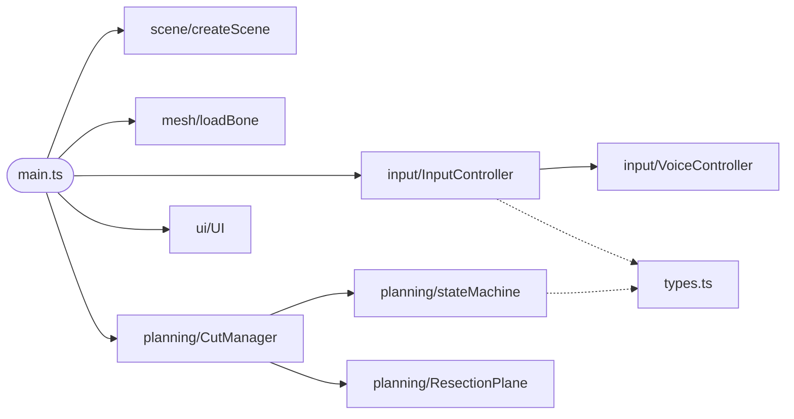
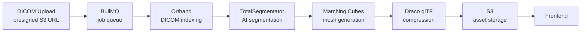
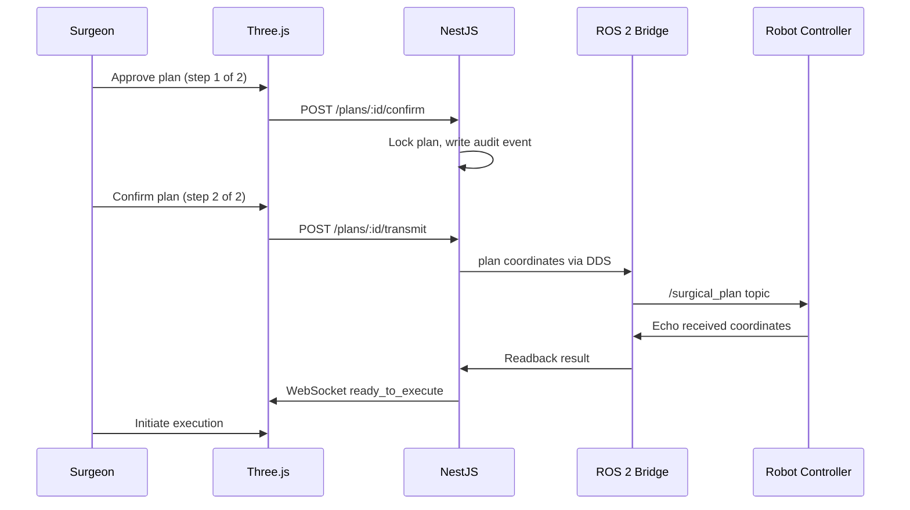
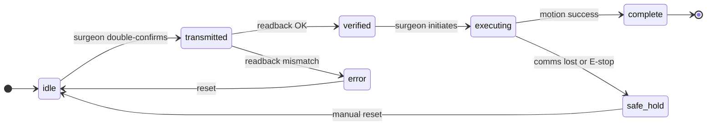

# Technical Assessment — Software Architect
**3D Surgical Planning & Robotics**

## Setup

```bash
pnpm install
pnpm dev
```

Open `http://localhost:5173`. Chrome is required for Web Speech API support.

## Controls

| Action | Voice | Keyboard / UI |
|---|---|---|
| Move plane up | "Up" | ↑ or dock button |
| Move plane down | "Down" | ↓ or dock button |
| Execute cut | "Cut" | dock button |
| Toggle proximal | "Remove Proximal" | dock button |
| Toggle distal | "Remove Distal" | dock button |
| Toggle cut mode | — | mode button (top-left of dock) |
| Reset scene | — | reset button (top-right) |

## Libraries

- **three** — 3D rendering
- **three-bvh-csg** — BVH-accelerated CSG for mesh cutting
- **three-mesh-bvh** — spatial acceleration for BVH
- **veloxi** — dock magnification physics

---

## Part 1: Proof of Concept

The PoC is a browser-based surgical planning tool: load an STL bone, position a resection plane with voice commands or keyboard, execute a cut via CSG, then toggle segment visibility. Single-cut and two-cut osteotomy modes.

I went with Three.js over Unity because reviewers can open a URL with no install or license. Voice recognition uses the Web Speech API natively, no server or API key required. Mesh cutting uses `three-bvh-csg` with axis-aligned box brushes and BVH-accelerated INTERSECTION operations: deterministic results, none of the floating-point instability from partial boolean approaches. Vite's dev loop is also faster than Unity's editor cycle for this kind of iterative work.

The architecture has one rule: modules don't import each other. `main.ts` is the only file that knows the whole system exists. `CutManager` owns the cut lifecycle and talks to the state machine; `InputController` owns voice and keyboard and emits typed commands; the scene module owns rendering. The state machine is a pure function: `validateCommand(state, cmd, context)` returns the next state and nothing else, which makes it easy to test and extend.



Two-cut mode adds a `first_cut_done` intermediate state. After the first cut, the plane repositions on the remaining segment before the second cut.

---

## Part 2: System Architecture

A caveat before getting into specifics: I don't have DICOM experience or surgical systems background. What follows is how I'd approach each problem as a software engineer: research into what the industry already uses, engineering principles, and honest reasoning about what I'd need to learn.

### DICOM Ingestion Pipeline

The instinct with any mature, complex format is: don't write a parser. Orthanc is an open-source DICOM server that came up repeatedly in research for this use case. It handles storage, indexing, and retrieval behind a REST API and runs as a Docker container.

Scans run 200–500MB, so uploads go directly from the client to S3 via presigned URLs. A BullMQ worker picks up the job: Orthanc for indexing, then the pipeline research pointed to: TotalSegmentator for AI segmentation, Marching Cubes to generate the mesh, Draco compression into glTF, then back to S3. The frontend just loads a glTF.



In production, Orthanc gets replaced by AWS HealthImaging or Google Cloud Healthcare API, managed platforms for data residency, and audit trails. Segmentation moves to GPU instances scaled by queue depth. The backend stays as an orchestration layer and never owns imaging data.

Segmentation runs 2–10 minutes per scan, which is why a job queue is necessary. The frontend subscribes via WebSocket for progress updates. A job that fails mid-way shouldn't restart from scratch on retry: each worker step checks whether its output already exists in S3 and skips if it does, making every step idempotent.

What I don't know is how much manual review TotalSegmentator's output needs before it's usable for surgical planning. My assumption is that a radiologist signs off on the segmentation before a plan gets marked as ready, but I don't know what that workflow looks like in practice, how often the AI output is wrong in ways that matter, or whether the review step lives inside this system or entirely outside it.

Surgical planning data is append-only: a `surgical_plan_events` table where every state change is an `INSERT` with a JSONB payload (plan created, plane repositioned, confirmed, transmitted, verified, executed), never an update. Medical software has hard audit requirements; the append-only model means the audit trail is the data model itself, not a separate logging layer. I considered CouchDB, which follows the same principle at the database level. PostgreSQL won out: it's more widely operated, JSONB handles the payloads, and enforcing append-only at the application layer is more explicit than relying on a database feature.

### Robotic Integration

From what I researched, ROS 2 over DDS is the standard in surgical robotics: pub/sub with real-time delivery guarantees that REST can't offer. The plan is a position and orientation in 3D space, transmitted once to the robot controller over a DDS topic. The robot echoes the coordinates back, and execute permission is only granted if they match. Audit events are written before transmission, so if it fails there's still a record of intent. Transmission is idempotent.

Two-step surgeon confirmation makes sense, you want extra friction before transmitting coordinates to a robot arm. What I don't know yet is whether that's how teams that actually shipped these systems handle it, or whether surgeons in practice find it protective or just annoying. I'd want to watch a few OR workflows before locking that in.

Pre-execution checks cover a lot: the server validates plan coordinates against the patient's CT-derived anatomy before the robot ever sees them, and readback catches anything corrupted in transit. But those only protect up to the moment the blade starts moving. During execution, the robot controller needs to enforce boundaries in real time. Stryker's Mako does this with haptic virtual walls that physically resist out-of-bounds movement. The hardware E-stop is a physical circuit that cuts power regardless of software state, and `safe_hold` requires physical intervention to reset.

There are two environments. The cloud handles DICOM processing, plan creation, and storage; the OR runs on an isolated local network with the finalized plan, the ROS 2 bridge, and the robot controller. The plan downloads before the case, audit logs sync back after. During the procedure, everything is local, no cloud dependency. Real-time latency (haptic feedback, boundary enforcement) stays between the controller and the robot on the local network, measured in milliseconds.





### Frontend Scalability & State Management

Modules have no cross-dependencies; only the orchestrator knows the whole system exists. It scales by adding more modules, not by changing the architecture.

The `validateCommand` function extends naturally to the full surgical workflow. PoC states (`plane_active → first_cut_done → cut_executed`) map cleanly to production states (`plan_active → plan_confirmed → plan_transmitted → verified → executing`). The function signature doesn't change. I wouldn't reach for a state machine library; the pure function is simpler, testable, and already working.

Voice, keyboard, and eventually physical control panels all emit through the same typed command interface. The scene has no business logic; it reacts to the planning layer. Swapping Web Speech API for a local Whisper model is a one-file change.

Production CT meshes can reach 500k–2M triangles. Rendering isn't the bottleneck; the CSG cut operation is. The pipeline outputs a simplified mesh suited for interactive cutting and t he cut runs on a separate thread so the UI stays responsive. If full-resolution cuts are needed, the alternative is server-side CSG - the surgeon positions the plane, submits the coordinates, and the backend returns the result.
